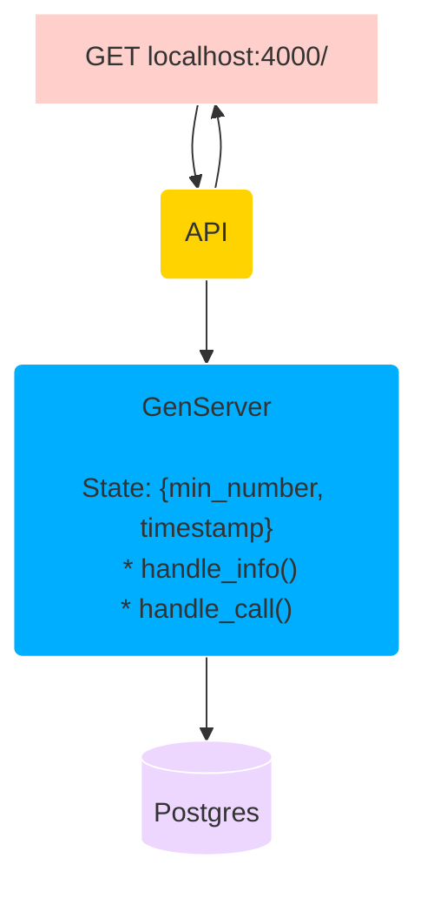

# Backend code exercise

Hello there!

If you're reading this it means you're now at the challenge step of the engineering hiring process WOOT WOOT WOOT.
We're really happy that you made it here and super appreciative of your time! And by the way don't spend too much time on it! 

This will help us understand how to best fit you into the team.
You'll definitely hear back from the team once you send it to us. 

If you have any questions don't hesitate to reach out to [code_exercise@remote.com](mailto:code_exercise@remote.com)

## What will you build

A phoenix api app, with a single endpoint.
This app will return, at max 2 (it can return less), users with more than a random number of points.
Weird uh? We know.

Keep it simple, assume this code would be put in production.
Don't overengineer it but also don't build something you'd have to apologise for while walking someone through it.

## Requirements

Follow these requirements :

- A good README
- Use postgres
- `mix ecto.setup` will create a `Users` table with 4 columns, id, points and the usual 2 timestamps.
    - `id` is autogenerated so no worries
    - `points` an integer that accepts any number between 0 and 100
    - `timestamps` autogenerated by ecto
    - This should generate 1,000,000 user seeds, each with 0 points.
- The app should start when you run without warnings (warnings in dependencies are okay) or errors using: `mix phx.server`
- When the app starts, a `genserver` should be launched which will:
    - Have 2 elements as state:
        - A random number (let's call it the `min_number`), [0 - 100]
        - A timestamp (which indicates the last time someone queried the genserver, defaults to `nil` for the first query)
    - Run every minute and when it runs:
        - Should update every user's points in the database (using a random number generator [0-100] for each)
        - Refresh the `min_number` of the genserver state with a new random number
    - Should accept a `handle_call` that:
        - Queries the database for all users with more points than `min_number` but only retrieve a max of 2 users.
        - Updates the genserver state `timestamp` with the current timestamp
        - Returns the users just retrieved from the database, as well as the timestamp of the **previous `handle_call`**
        
- Build a single endpoint, root `/`:
    - This can be handled by an action which will call the previously mentioned `genserver` and return the result.
    

Something like:

`GET localhost:4000/`

```elixir
{
  'users': [{id: 1, points: 30}, {id: 72, points: 30}],
  'timestamp': `2020-07-30 17:09:33`
}
```

Here's a conceptual image of our exercise, don't focus on the details, this is just so you get a mental idea of how it looks like:



## How to do it

- Take as long as you need, no need to rush it.
- Remove this README and use this repo to build the app according to the requirements.
- Tell us at [code_exercise@remote.com](mailto:code_exercise@remote.com) when you're done and include any feedback on this exercise you feel you'd like to share.
